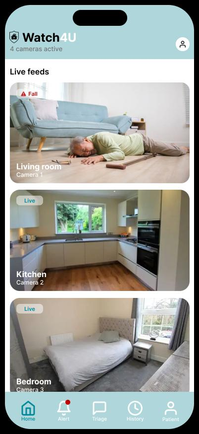
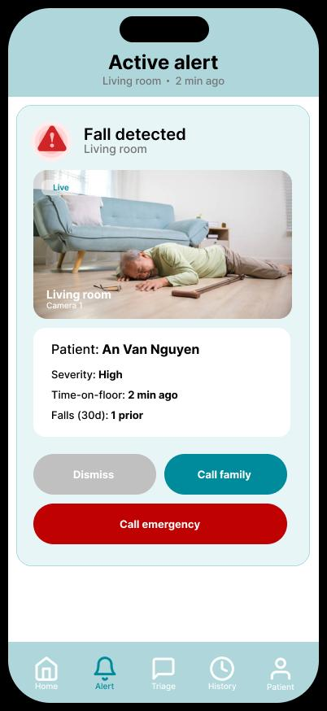
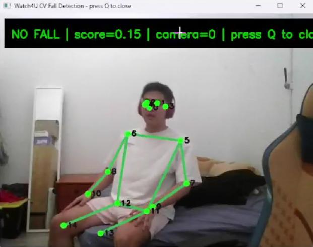
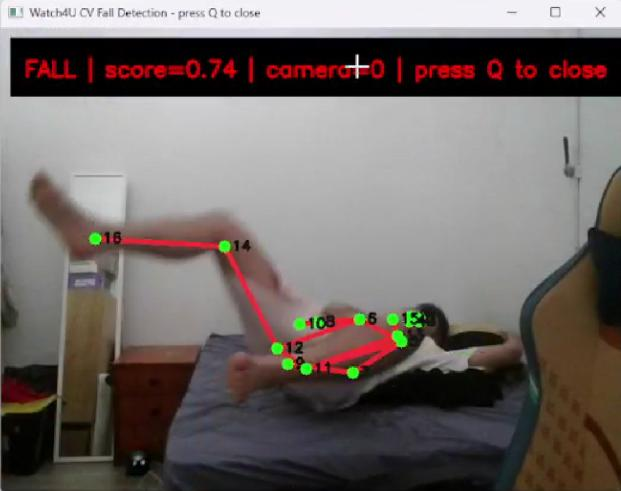

# Watch4U

Context-aware AI fall detection with multilingual staged escalation for CALD seniors.

Watch4U is a 41004 Group 43A prototype that combines computer-vision fall detection, resident risk profiles, triage escalation, and multilingual support into one monitoring workflow.

## Overview

The current project is a Phase 1 prototype:

- **Streamlit app** for the interactive demo UI
- **FastAPI backend** for service endpoints and domain logic
- **FallVision data pipeline** for pose-based fall detection experiments
- **Synthetic resident data** for patient profiles, triage, and system-flow demos

The fall-detection demo uses pose keypoints to distinguish normal posture from fall-like movement. The webcam prototype displays live skeleton tracking and classifies each rolling pose window as `NO FALL` or `FALL`.

## Prototype Visuals

The A3 prototype includes a mobile monitoring concept and live CV fall-detection demo.

| Live feeds | Active alert |
| --- | --- |
|  |  |

| No fall detected | Fall detected |
| --- | --- |
|  |  |

## Project Structure

```text
Watch4U/
|-- backend/        FastAPI service and domain modules
|-- streamlit_app/  Streamlit prototype UI
|-- data/           Synthetic profiles and FallVision preprocessing
|-- docs/           Reports and assignment documents
|-- frontend/       Future Next.js app placeholder
|-- docker-compose.yml
|-- Makefile
`-- README.md
```

## Features

- Resident profile browsing with risk indicators and event history
- CAT 1-5 triage simulation with staged escalation
- English and Vietnamese response prompts
- Fall detection using pose keypoints and temporal motion features
- Data pipeline demo for preprocessing and feature extraction
- Database explorer and full-system workflow pages
- FastAPI backend with modular service folders

## Prerequisites

For the standard workflow, install:

- Docker 20.10+
- Docker Compose v2.0+
- Git
- GNU Make, optional but recommended

Python and Node.js are not required when running through Docker.

## Quickstart

From the repository root, create the local environment files:

```powershell
Copy-Item backend\.env.example backend\.env
Copy-Item streamlit_app\.env.example streamlit_app\.env
```

Start the backend and Streamlit prototype:

```powershell
docker compose up --build
```

Or, if Make is available:

```powershell
make up
```

Open:

- Streamlit prototype: <http://localhost:8501>
- FastAPI Swagger docs: <http://localhost:8000/docs>

## Common Commands

```powershell
make up          # Start backend and Streamlit
make backend     # Start FastAPI only
make streamlit   # Start Streamlit only
make restart     # Rebuild and restart all services
make logs        # Tail Docker logs
make down        # Stop services
make clean       # Stop services and remove volumes
```

Equivalent Docker commands:

```powershell
docker compose up --build
docker compose up --build backend
docker compose up --build streamlit
docker compose logs -f
docker compose down
```

## Streamlit Demo Pages

The Streamlit prototype is the main interface for the current submission. Pages are available from the sidebar:

| Page | Purpose |
| --- | --- |
| Resident Management | Browse residents, risk levels, carers, and fall history |
| Triage Simulator | Test CAT classification and staged escalation |
| Fall Detection | Upload or select videos for pose-based fall analysis |
| Data Pipeline | Inspect preprocessing and feature extraction |
| Database Explorer | View resident and fall-event data structures |
| Full System Flow | Walk through the complete detection-to-escalation workflow |
| RAG Chat | Prototype multilingual medical Q&A |
| Wi-Fi Detection | Placeholder for CSI-based motion sensing |

## Fall Detection

The fall-detection component is located at:

```text
backend/app/services/fall_detection/
```

It uses a pose-based temporal strategy rather than raw image classification:

```text
FallVision keypoint CSVs
  -> cleaned single-person skeleton sequences
  -> temporal motion features
  -> baseline fall classifier
  -> video upload and webcam demos
```

Current baseline test results:

| Metric | Result |
| --- | ---: |
| Accuracy | 88.09% |
| Fall precision | 85.85% |
| Fall recall | 87.50% |
| Fall F1-score | 86.67% |

Scene-level performance:

| Scene | F1-score |
| --- | ---: |
| Bed | 74.67% |
| Chair | 92.31% |
| Stand | 94.29% |

Bed scenes are the hardest case because normal lying postures can resemble post-fall positions.

## Webcam Demo

The webcam demo requires a local Python environment because it needs camera access:

```powershell
python -m pip install -r backend/requirements.txt
python data/preprocessing/fallvision_train_baseline.py
python -m backend.app.services.fall_detection.webcam_demo --download-pose-model --mirror
```

After the first run, the pose model is saved locally and the demo can be started with:

```powershell
python -m backend.app.services.fall_detection.webcam_demo --mirror
```

Press `q` to close the webcam window.

## Component Ownership

| Component | Owner(s) | Path |
| --- | --- | --- |
| RAG workflow | Ryan | `backend/app/services/rag/` |
| Triage logic | Jayce | `backend/app/services/triage/` |
| Fall detection | Darrel | `backend/app/services/fall_detection/` |
| Wi-Fi detection | Ryan | `backend/app/services/wifi_detection/` |
| Backend setup | Ryan, Muhamad | `backend/` |
| Synthetic data and preprocessing | Affan | `data/` |

## Documents

- A1 Plan and Proposal: `docs/41004 A1.docx`
- A2 Mid-Project Update: `docs/41004 A2.docx`
- Fall Detection Training Report: `docs/fall_detection_report.md`

## Roadmap

- Phase 1: Streamlit prototype and FastAPI backend
- Phase 2: Replace Streamlit with a Next.js frontend in `frontend/`
- Keep backend service modules stable so UI layers can change independently
